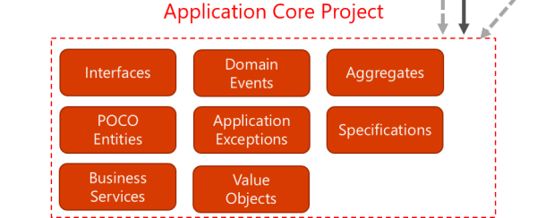

# Bienvenido a Kustodya.Core.Reportes❗ 💪

Este proyecto contiene el comportamiento y estado de los reportes de Kustodya; esto es, la capa de dominio (Damin layer) del servicio de reportes, siguiendo los lineamientos de arquitectura de Diseño Dirigido por el Dominio (DDD) de Roojo Tech SAS. 

Este proyecto tiene la filosofía de que la lógica de negocio no debe depender de nada, así que no contiene referencias a otros proyectos de capas superiores❗ si vas a agregar referencias piensalo dos veces.

En los proyectos core encontraras:

* Entidades 💎
* Interfaces 👷‍♂️
* Servicios de Dominio 🐕‍🦺
* Especificaciones 🔍
* DTOs 🚇

## Entidades 💎

Son clases POCO (Plain Old C# Objects) que representan objetos del dominio de la aplicación que no solo tienen estado sino comportamiento. En este caso el **Reporte** el **UsoDeReporte** y otros objetos que atañen al dominio de la reportería de Kustodia.

Las entidades siguen patrones de diseño como las fabrica, tipos de valor, setters privados etc.

## Servicios de Dominio 🐕‍🦺

Implementan logica de dominio que no pertenece a un agregado en particular, que probablemente abarca más de un agregado, y que usualmente necesita de un servicio de la capa de infraestructura como la persistencia. Coordinan los agregados y los repositorios con el proposito de implementar una acción del negocio. Puede que consuman servicios de la infraestructura como el envío de correos.

Las acciones de los servicios de dominio nacen de requerimientos y están aprobadas por expertos del dominio.

## Interfaces 👷‍♂️

Son contratos de servicio que representan:

* Servicios del dominio: Que represnetan casos de uso de la aplicación, como consultar un reporte.
* Servicios para el dominio: Que el dominio necesita para funcionar como la autenticación de un usuario para poder consultar un reporte.

## Especificaciones 🔍

Contienen la logica de consulta, filtrado, paginación, orden etc, que se usa para consultar las entidades desde los servicios del dominio.

## Objetos de Transferencia de Datos (DTOs)  🚇

A veces los servicios o interfaces definidos en esta capa necesitan trabajar con tipos que no son entidades y que no tienen dependencias en la interfaz de Usuario (UI), la Interfaz de Programacion de Aplicaciones (API) web. Estos pueden definirse como simples Objetos de transferencia de datos (DTOs).